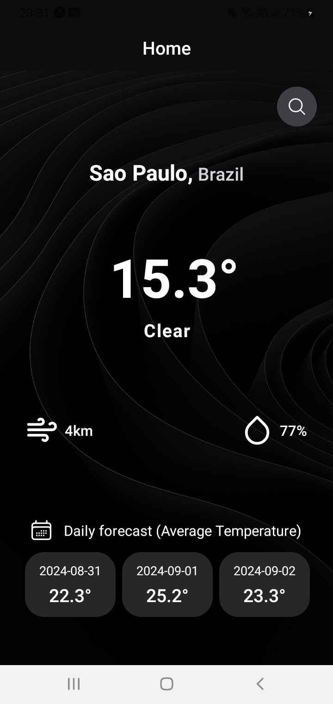

# Metrio

A weather forecast app featuring a minimalistic UI. Metrio keeps you informed about conditions including temperature, humidity and wind.

## Demo



## Setup

1. You'll need an API Key from [weatherapi](https://www.weatherapi.com/). Just make an account, and copy the key.
2. Create a .env file in the project's root directory, and paste your API Key, as follows:

```
API_KEY=<your key here>
```

3. As we are using Typescript, we also need a env.d.ts file. Create one in project's the root directory and paste the following content:

```typescript
declare module '@env' {
    export const API_KEY: string
}
```

4. Setup done! You can now [test the app](#test).


## Test

You can easily test this app by running the following commmands (with Expo):

```
npm i
npx expo start
```

